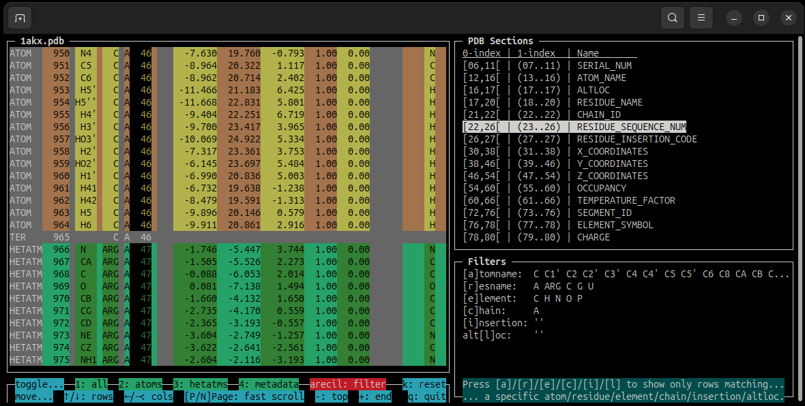

# MolPrisma
This is a tool for fast inspection of PDB molecular files inside the terminal. It is very lightweight, its only dependency being the [Prisma TUI](https://github.com/DiegoBarMor/prismatui) framework (which itself has no dependencies for Linux).

## Quickstart
```bash
pip install molprisma
molprisma your_file.pdb
```

## Features

- Use the `UP`,`DOWN`,`PREVPAGE`,`NEXTPAGE`, `-` (top) and `+` (end) keys to quickly nagivate through the PDB rows.
- Use the `LEFT` and `RIGHT` keys to highlight a concrete PDB section (i.e. column) and see their indices/name (according to [the standard](https://www.cgl.ucsf.edu/chimera/docs/UsersGuide/tutorials/pdbintro.html)).
    - Visual separation of the PDB sections via colors also helps to easily spot offset issues.
- Show/hide whole groups of rows via a simple key press:
    - `1`: Toggle between showing all or showing nothing.
    - `2`: Toggle the *atoms* (lines starting with `ATOM`).
    - `3`: Toggle the *heteroatoms* (lines starting with `HETATM`).
    - `4`: Toggle the *metadata* (everything else not considered by `2` or `3`). It is hidden by default.
- Filter out rows that don't match a specific combination of values.
    - `a`: Alternate *atom_name* value to filter.
    - `r`: Alternate *residue_name* value to filter.
    - `e`: Alternate *element_id* value to filter.
    - `c`: Alternate *segment_id* (a.k.a chain) value to filter.
    - `i`: Alternate *residue_insertion_code* value to filter.
    - `l`: Alternate *altloc* (i.e. alternate location indicator) value to filter.
- Reset the shown/hidden groups and the filters at any moment by pressing `k`.
